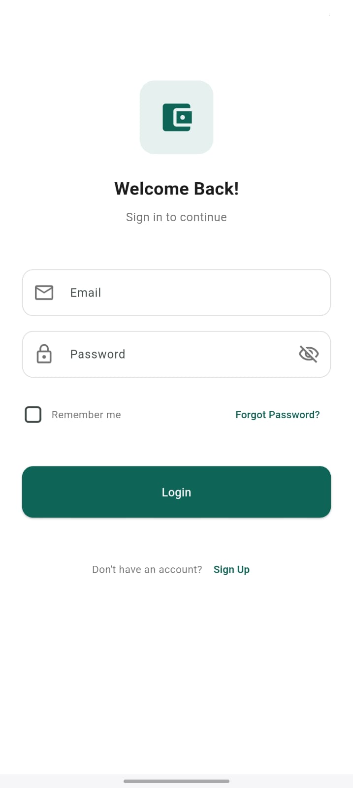
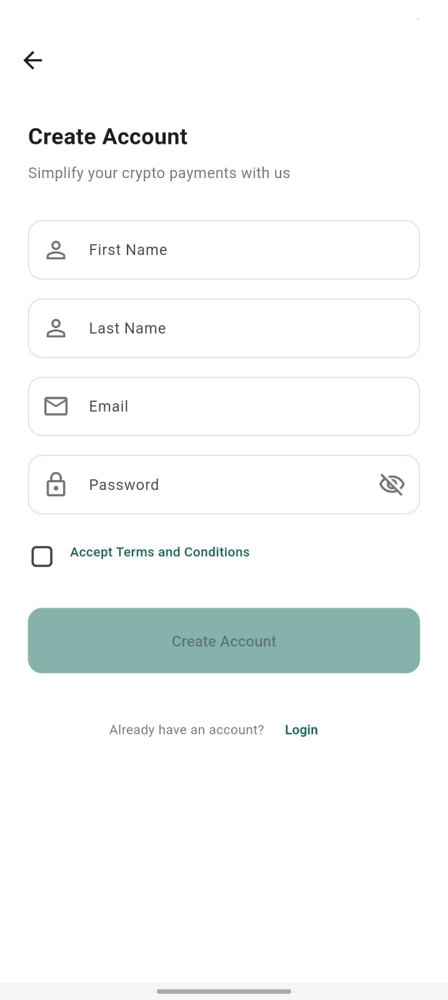
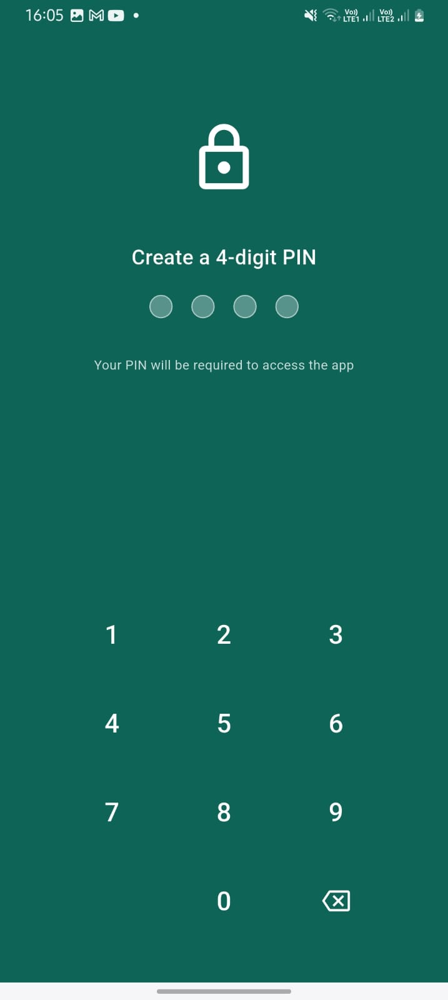
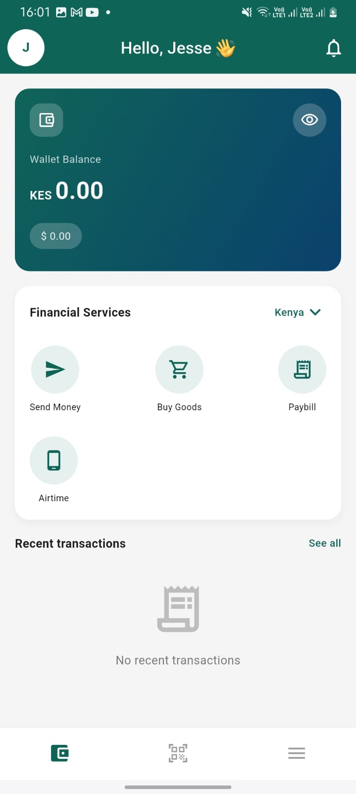

# Pretium - Crypto Payment App

A modern, user-friendly crypto payment application designed for simplicity and elegance. Pretium lets users manage payments, bills, and transactions with cryptocurrency across Africa.

## Screenshots

<div style="display: flex; flex-wrap: wrap; justify-content: space-between;">
  
  
  
  
</div>

## Features

- **Multi-step Onboarding** - Introduces users to key app features
- **Secure Authentication** - Email/password login with PIN protection
- **Bill Payments** - Pay utilities
- **Direct Pay** - Send crypto payments
- **Wallet Dashboard** - Track balance and transaction history
- **Financial Services** - Access various payment services

## Getting Started

### Prerequisites

- Flutter SDK (3.7.2 or higher)
- Dart SDK (3.0.0 or higher)
- Android Studio / VS Code with Flutter extensions
- Android or iOS emulator/device

### Installation

1. **Clone the repository**
   ```bash
   git clone https://github.com/yourusername/pretium.git
   cd pretium
   ```

2. **Install dependencies**
   ```bash
   flutter pub get
   ```

3. **Run the app**
   ```bash
   flutter run
   ```

### Project Structure

```
lib/
├── core/
│   └── theme/          # App colors and custom icons
├── features/
│   ├── splash/         # Splash screen
│   ├── onboarding/     # Onboarding screens
│   ├── auth/           # Authentication (login, signup, PIN)
│   └── home/           # Main app screens and dashboard
└── main.dart           # Entry point of the application
```

## Development Notes

- This app follows a feature-first architecture
- Consistent design system with shared colors and components
- Fully responsive layouts that work on various screen sizes
- Clean, documented code for maintainability

## Customization

### Changing App Colors

Edit the color palette in `lib/core/theme/app_colors.dart` to match your brand:

```dart
static const Color primary = Color(0xFF0F6458); // Primary teal color
```

### Adding Custom Icons

To add new icons, extend the `AppIcons` class in `lib/core/theme/app_icons.dart`:

```dart
static Widget newIcon({double size = 48.0, Color color = const Color(0xFF0F6458)}) {
  // Your custom icon implementation
}
```

## Setup Screenshots Directory

Create a directory for your screenshots before adding them:

```bash
mkdir -p screenshots
# Place pic1.jpg, pic2.jpg, pic3.jpg, pic4.jpg in the screenshots directory
```

## License

This project is licensed under the MIT License - see the LICENSE file for details.

## Credits

Developed by Jesse Jackson
